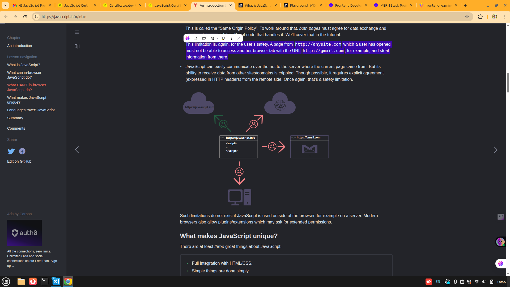
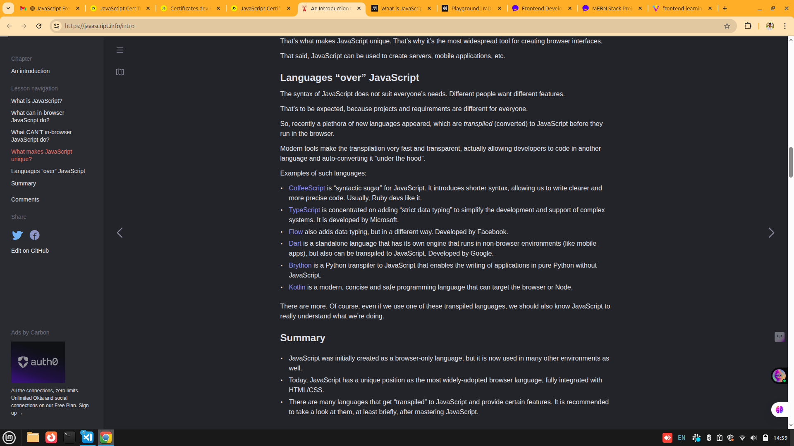
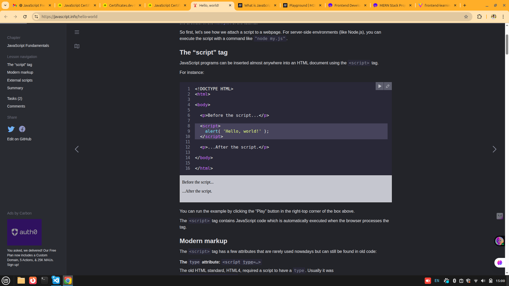

js **certificate** - https://certificates.dev/javascript/dashboard/training/js-level-2-training?chapter=chapter-0-start-here&part=2

1. Node.js
Node.js is an open-source, cross-platform JavaScript runtime environment that executes JavaScript code outside of a web browser.

1) JavaScript is the programming language of the web browser and can also be found on web servers, IoT devices, and more.

2) The js will run in web browser and as well is any machine which has js engine.
3) v8 - in chrome, edge, opera.

**How do engines work?**
    Engines are complicated. But the basics are easy.

    The engine (embedded if it’s a browser) reads (“parses”) the script.
    Then it converts (“compiles”) the script to machine code.
    And then the machine code runs, pretty fast.
    The engine applies optimizations at each step of the process. It even watches the compiled script as it runs, analyzes the data that flows through it, and further optimizes the machine code based on that knowledge.

4) Js will not provide the low level access to memory or the CPU.

**For instance, in-browser JavaScript is able to:**

    Add new HTML to the page, change the existing content, modify styles.
    React to user actions, run on mouse clicks, pointer movements, key presses.
    Send requests over the network to remote servers, download and upload files (so-called AJAX and COMET technologies).
    Get and set cookies, ask questions to the visitor, show messages.
    Remember the data on the client-side (“local storage”).

5) What js cant do (it cannot the access the other pages or other tabs or other domains etc), this is for he users safety.

example: This limitation is, again, for the user’s safety. A page from http://anysite.com which a user has opened must not be able to access another browser tab with the URL http://gmail.com, for example, and steal information from there.

6) What makes js unique from all other languages.

    It can integrate into html/css
    Simple things can done simply.
    Supproted by all other browsers enabled by default.

7) 
8) 

9) **Please note:**
        As a rule, only the simplest scripts are put into HTML. More complex ones reside in separate files.

        The benefit of a separate file is that the browser will download it and store it in its cache.

        Other pages that reference the same script will take it from the cache instead of downloading it, so the file is actually downloaded only once.

        That reduces traffic and makes pages faster.

10) alert('hello);
    [1,2].forEach(alert);

    alert('hello')
    [1,2].forEach(alert);

the above both are different execute and check.

11) 
