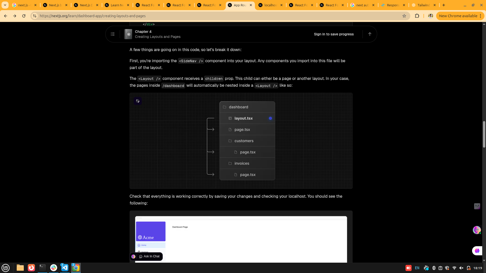

Why React : we are using this because in js for hanlding the data and ui in dom is difficult and 

**About layout.tsx**:

One benefit of using layouts in Next.js is that on navigation, only the page components update while the layout won't re-render. This is called partial rendering which preserves client-side React state in the layout when transitioning between pages.

**About Link component in nextjs**:

In Next.js, you can use the <Link /> Component to link between pages in your application. <Link> allows you to do client-side navigation with JavaScript.

Automatic code-splitting and prefetching
To improve the navigation experience, Next.js automatically code splits your application by route segments. This is different from a traditional React SPA, where the browser loads all your application code on the initial page load.

Splitting code by routes means that pages become isolated. If a certain page throws an error, the rest of the application will still work. This is also less code for the browser to parse, which makes your application faster.

Furthermore, in production, whenever <Link> components appear in the browser's viewport, Next.js automatically prefetches the code for the linked route in the background. By the time the user clicks the link, the code for the destination page will already be loaded in the background, and this is what makes the page transition near-instant!

**clsx condtional ui** :

You can use the clsx library introduced in the chapter on CSS styling to conditionally apply class names when the link is active. When link.href matches the pathname, the link should be displayed with blue text and a light blue background